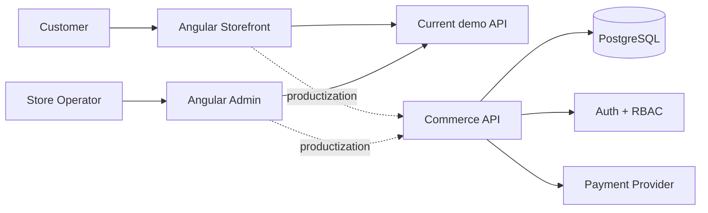

# Market Commerce Suite

[](https://github.com/SamirNexus/Market/actions/workflows/ci.yml)

Market is being consolidated into a single commerce product repository with two Angular applications:

- **Storefront** — customer-facing catalog, product details, cart state, and demo checkout.
- **Admin** — operations interface for product catalog and cart/order inspection.

**Storefront demo:** https://market-two-rosy.vercel.app  
**Legacy admin demo:** https://market-admin-tau.vercel.app

## Repository structure

```text
Market/
├── apps/
│   ├── storefront/   # Customer-facing Angular application
│   └── admin/        # Operations/admin Angular application
├── docs/
│   ├── architecture.md
│   └── productization-roadmap.md
├── .github/workflows/ci.yml
├── package.json
└── vercel.json
```

## Current product scope

### Storefront

- Catalog loaded from Fake Store API
- Search, sorting, and API-based category filtering
- Product details routing
- Reactive cart state with localStorage persistence
- Demo checkout flow
- Behavioral tests and production build validation

### Admin

- Product catalog listing
- Product creation form
- Cart/order list with date filtering
- Cart detail inspection
- Cart deletion against the external demo API

## Important product boundary

The repository is now structured like a real multi-application product, but the current data layer still depends on **Fake Store API**, which is a demo service and does not provide durable production commerce behavior.

Features such as durable product writes, authentication, roles, inventory, customer accounts, payment processing, audit logs, and reliable order state are therefore **not yet represented as production-ready capabilities**.

The productization roadmap in `docs/productization-roadmap.md` defines the work required to turn this codebase into a deployable and sellable commerce starter.

## Local development

Install both applications:

```bash
npm run install:all
```

Run the storefront:

```bash
npm run start:storefront
```

Run the admin dashboard in a second terminal:

```bash
npm run start:admin
```

Angular will default to port 4200, so when running both simultaneously pass a different port to one application:

```bash
npm --prefix apps/admin start -- --port 4201
```

## Quality checks

```bash
npm run build
npm run test:storefront
```

GitHub Actions builds both applications and runs the storefront behavioral test suite on every pull request and push to `master`.

## Architecture direction



The solid arrows show the current implementation. Dashed arrows show the planned production architecture.

## Author

**Mohamed Samir** — Front-End Developer  
[GitHub](https://github.com/SamirNexus) · [LinkedIn](https://www.linkedin.com/in/samirnexus98/)
