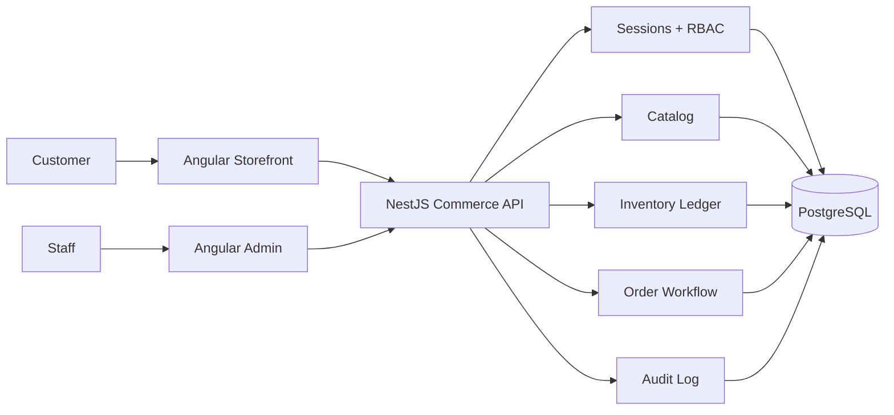

# Market Commerce Suite

Market is one commerce product delivered through three coordinated applications:

- **Storefront** — customer shopping experience.
- **Admin** — authenticated staff operations dashboard.
- **API** — commerce business rules, persistence, identity, and integrations.

Commercially this is **one product**. Technically the customer UI, staff UI, and backend stay independently deployable so security boundaries, scaling, testing, and releases remain manageable.

> Market is in launch-candidate hardening. The owned commerce backend, staff security model, merchant settings, provider-neutral payment persistence, Stripe Checkout adapter, verified webhook lifecycle, container deployment model, and CI quality gates are implemented. Live gateway credentials, production infrastructure cutover, monitoring, restore verification, and final end-to-end launch checks remain environment/operator work.

## Applications

| Application | Path | Purpose |
| --- | --- | --- |
| Storefront | `apps/storefront` | Customer catalog, cart, and checkout experience |
| Admin | `apps/admin` | Authenticated catalog, inventory, order, and staff operations |
| API | `apps/api` | Business rules, PostgreSQL persistence, auth/RBAC, and integrations |

### Current public demos

- Storefront: https://market-two-rosy.vercel.app
- Admin legacy deployment: https://market-admin-tau.vercel.app

The public demos remain historical deployments while the owned API-backed production cutover is prepared. Development storefront/admin flows now use the owned API, and the repository includes container/runtime deployment configuration without silently repointing the existing public demos.

## Repository structure

```text
Market/
├── apps/
│   ├── storefront/
│   ├── admin/
│   └── api/
├── packages/
│   └── contracts/
├── docs/
│   ├── ARCHITECTURE.md
│   └── PRODUCT_ROADMAP.md
├── compose.yaml
├── .github/workflows/ci.yml
├── package.json
└── vercel.json
```

## Current product architecture



The API is the source of truth for pricing, stock, order state, permissions, and privileged operations. Browser applications do not own those business rules.

## Implemented backend foundations

- versioned NestJS API under `/api/v1`
- PostgreSQL + Prisma migrations
- product CRUD with soft archival
- atomic stock decrements
- inventory movement ledger
- server-priced order creation
- controlled order-state transitions
- restocking on cancellation
- paginated/filterable admin order queries
- staff authentication with short-lived access tokens
- revocable, rotating refresh sessions
- HttpOnly refresh-token cookies
- STAFF / ADMIN / OWNER RBAC
- protected admin routes
- staff account lifecycle management
- audit events for sensitive admin mutations
- deterministic dependencies, migrations, seed data, API tests, and CI
- runtime-configurable frontend API endpoints
- production Docker images for storefront, admin, API, and migrations
- production Compose model with health checks and migration gating
- persistent merchant settings for store name, support email, branding color/logo, currency, locale, tax rate, shipping fee, and free-shipping threshold
- provider-neutral payment persistence with manual fallback and Stripe Checkout adapter
- verified Stripe webhook signature handling and idempotent payment/order synchronization

## Local development

Start PostgreSQL:

```bash
docker compose up -d postgres
```

Install dependencies:

```bash
npm run install:all
npm run install:api
```

Create the API environment file:

```bash
cp apps/api/.env.example apps/api/.env
```

Optionally set `OWNER_EMAIL` and a 12+ character `OWNER_PASSWORD` before seeding to bootstrap the first owner account.

Prepare the API database:

```bash
npm --prefix apps/api run prisma:generate
npm --prefix apps/api run prisma:migrate:deploy
npm --prefix apps/api run prisma:seed
```

Run each application in its own terminal:

```bash
npm run start:api
npm run start:storefront
npm run start:admin
```

Use a different Angular port when running both front ends simultaneously.

## Quality gates

```bash
npm run build
npm run test:storefront
npm run test:admin
npm run test:api
```

CI additionally starts PostgreSQL, applies migrations, seeds the database, validates Prisma, then tests and builds the API.

## Product status

The project is now beyond a front-end portfolio demo: it has an owned persistence and security foundation. It is a launch candidate, not a claim that production infrastructure is already live. The repository contains the application and deployment foundations; production URLs, managed secrets, gateway credentials, monitoring, restore testing, and final end-to-end smoke checks must be completed in the target environment.

See:

- `docs/ARCHITECTURE.md`
- `docs/PRODUCT_ROADMAP.md`
- `docs/DEPLOYMENT.md`
- `docs/LAUNCH_CHECKLIST.md`

## Author

**Mohamed Samir** — Front-End Developer  
[GitHub](https://github.com/SamirNexus) · [LinkedIn](https://www.linkedin.com/in/samirnexus98/)
