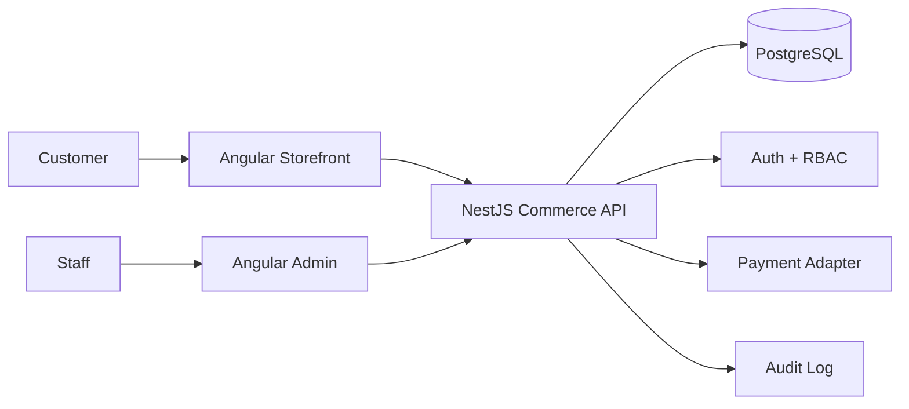

# Market Commerce Suite

Market is one commerce product delivered through three coordinated applications:

- **Storefront** — customer shopping experience.
- **Admin** — staff operations dashboard.
- **API** — shared commerce backend and business-rule boundary.

That structure is intentional: commercially it is **one product**, while technically the customer UI, staff UI, and backend remain independently deployable. This keeps the system easier to secure, scale, test, and maintain than forcing everything into one front-end bundle.

> Market is being upgraded from a portfolio demo into a reusable commerce product foundation. It is not yet presented as production-ready commerce software until authentication, authorization, persistent backend workflows, payments, deployment controls, and end-to-end coverage are complete.

## Applications

| Application | Path | Purpose |
| --- | --- | --- |
| Storefront | `apps/storefront` | Customer catalog, cart, and checkout experience |
| Admin | `apps/admin` | Staff catalog and order operations |
| API | `apps/api` | Business rules, persistence, authentication boundary, and integrations |

### Current live demos

- Storefront: https://market-two-rosy.vercel.app
- Admin legacy deployment: https://market-admin-tau.vercel.app

The current public demos still use the historical front-end deployments while the new API-backed product architecture is built and validated.

## Repository structure

```text
Market/
├── apps/
│   ├── storefront/
│   ├── admin/
│   └── api/
├── packages/
│   └── contracts/
├── docs/
│   ├── ARCHITECTURE.md
│   └── PRODUCT_ROADMAP.md
├── compose.yaml
├── .github/workflows/ci.yml
├── package.json
└── vercel.json
```

## Product architecture



The API is the source of truth for pricing, stock, order state, permissions, and other business rules. Neither browser application should be trusted to enforce privileged commerce logic.

## Backend foundation now in progress

The API foundation includes:

- NestJS application structure
- versioned route prefix `/api/v1`
- environment configuration
- global request validation
- controlled CORS configuration
- Prisma database layer
- PostgreSQL schema for products, users, orders, order items, and audit logs
- health endpoint
- initial product CRUD
- soft archival instead of destructive product deletion
- Docker Compose PostgreSQL service for local development

## Local development

Install the two existing Angular applications:

```bash
npm run install:all
```

Run PostgreSQL:

```bash
docker compose up -d postgres
```

The API package is currently being scaffolded. Its lockfile and CI gate are added before this backend branch is merged.

## Existing quality commands

```bash
npm run build
npm run test:storefront
```

Current suite CI validates storefront and admin builds/tests. API build, test, migration validation, and database integration become required gates as the backend foundation is completed.

## Product status

The monorepo and front-end quality baseline are complete. The current commercial-risk priority is replacing Fake Store API with owned persistence and server-side business rules.

See:

- `docs/ARCHITECTURE.md`
- `docs/PRODUCT_ROADMAP.md`

## Author

**Mohamed Samir** — Front-End Developer  
[GitHub](https://github.com/SamirNexus) · [LinkedIn](https://www.linkedin.com/in/samirnexus98/)
