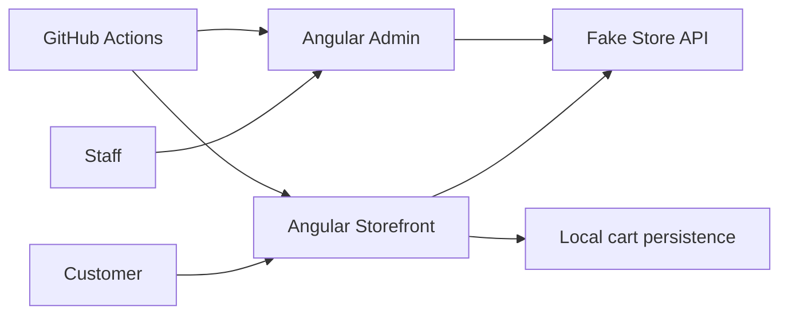
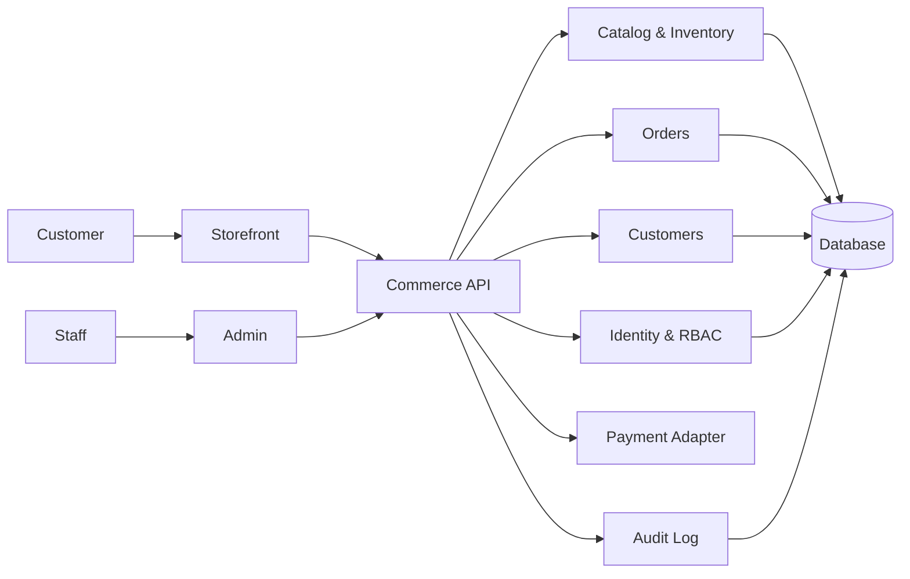

# Market Commerce Suite — Architecture

## Product boundary

Market contains two independently deployable Angular applications:

1. **Storefront** for customer-facing commerce.
2. **Admin** for internal operational workflows.

Staff-only code should not ship in the customer bundle, and customer presentation concerns should not leak into admin workflows.

## Current architecture

The Fake Store API is a temporary integration boundary. It makes the UI functional but does not provide the guarantees required for a commercial commerce product.

## Target production architecture

## Engineering rules

- Storefront and admin remain independently buildable and deployable.
- Secrets and privileged operations never live in browser code.
- Admin mutations require authenticated server-side authorization.
- External providers sit behind adapters where practical.
- Shared contracts are typed and versioned before cross-app reuse.
- CI is a merge gate for builds and meaningful tests.
- Product and sales claims must match implemented behavior.

## Planned shared layer

After admin hardening, introduce a `packages/contracts` library for shared DTOs and validation. UI remains app-specific unless a real design-system need emerges.
