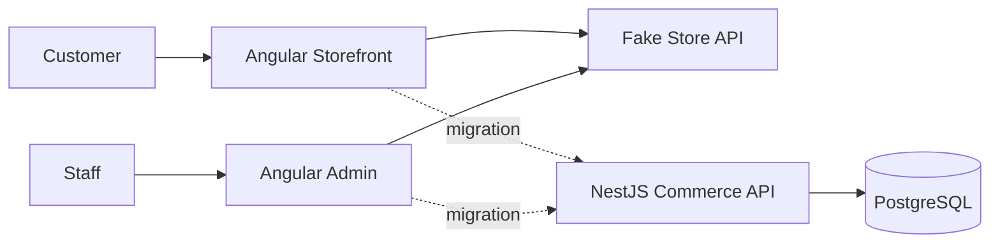
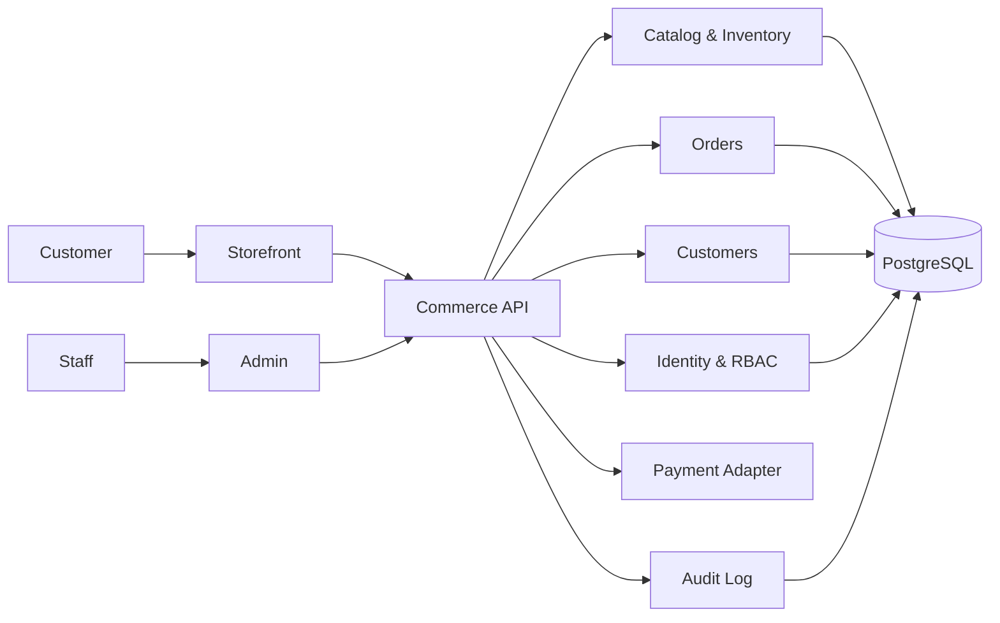

# Market Commerce Suite — Architecture

## Product model

Market is **one commercial product** with three deployable applications:

1. **Storefront** for customers.
2. **Admin** for staff.
3. **Commerce API** for shared business rules and persistence.

Keeping those applications separate does not make them separate products. It creates cleaner trust boundaries and allows customer traffic, staff operations, and backend workloads to evolve independently.

## Current transition architecture

The front ends still use Fake Store API while the owned API is being built. Migration happens domain by domain rather than through a risky all-at-once cutover.

## Target production architecture

## Backend stack

- NestJS
- PostgreSQL
- Prisma
- DTO validation with class-validator
- environment-based configuration
- versioned REST API

## Current API domains

The first backend slice establishes:

- health
- products
- users schema
- orders schema
- order items
- audit log

Authentication, authorization, payments, shipping, and notifications are intentionally not faked. They are added as real server-side capabilities in later slices.

## Engineering rules

- Market is marketed and versioned as one product.
- Storefront, admin, and API remain independently buildable and deployable.
- Staff-only code never ships in the customer bundle.
- Secrets and privileged operations never live in browser code.
- Admin mutations require authenticated server-side authorization before production use.
- Price, stock, and order-state validation happen server-side.
- External providers sit behind adapters.
- Shared contracts remain typed and intentionally small.
- CI is a merge gate for builds, tests, and database migrations.
- Product claims must match implemented behavior.
