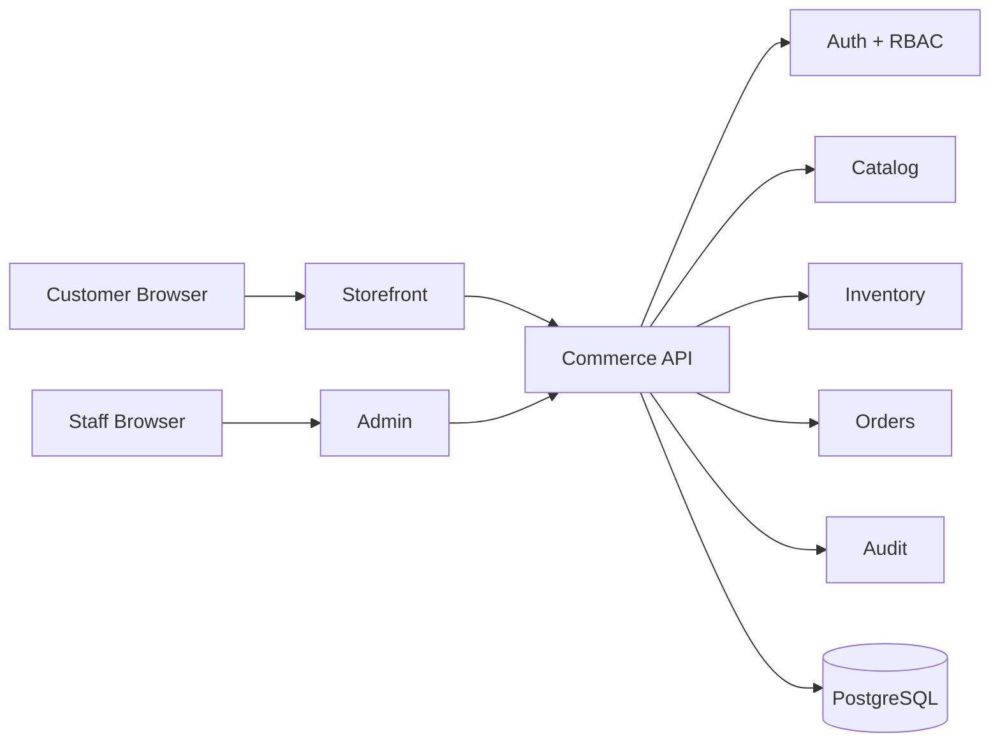

# Market Commerce Suite — Architecture

## Product model

Market is **one commercial product** with three deployable applications:

1. **Storefront** for customers.
2. **Admin** for staff.
3. **Commerce API** for identity, business rules, persistence, and integrations.

The separation is a deployment and trust-boundary decision, not a product split.

## Trust boundaries



- the storefront receives no staff-only code or credentials
- the admin requires authenticated staff sessions
- browser input is never trusted for price, stock, permission, or order-state decisions
- refresh credentials are kept in HttpOnly cookies
- access tokens are short-lived and checked against revocable server-side sessions
- privileged mutations are role-gated server-side

## Identity and authorization

Roles currently form a small hierarchy:

- **STAFF** — operational catalog, inventory, and order work
- **ADMIN** — staff operations plus destructive/archive and staff-account administration
- **OWNER** — highest current administrative authority, including admin-account creation/deactivation

The API uses rotating refresh-session secrets stored only as hashes. Access-token validation also checks the backing session and active user state, so staff deactivation/revocation is enforceable server-side.

## Catalog and inventory

Products retain a current `stock` balance for efficient reads. Every manual adjustment, sale decrement, and cancellation restock also creates an immutable inventory movement record.

Order placement uses a serializable database transaction and conditional stock decrement. This prevents the browser from setting price and reduces oversell risk under concurrent writes.

## Order workflow

Order totals are calculated from database product prices. Order items snapshot title, SKU, and unit price so historical orders remain understandable after catalog changes.

Supported state transitions are explicit rather than arbitrary:

```text
PENDING -> CONFIRMED -> PROCESSING -> SHIPPED -> DELIVERED -> REFUNDED
    \          \           \
     +----------+-----------+----> CANCELLED (before shipment)
```

Cancellation restocks inventory in the same transactional boundary as the status change.

## Auditability

Sensitive mutations record actor, action, entity, entity ID, timestamp, and scoped metadata. Audit logging is designed to happen in the same database transaction as the business mutation where consistency matters.

## Backend stack

- NestJS
- PostgreSQL
- Prisma
- class-validator / class-transformer
- short-lived JWT access tokens
- hashed rotating refresh sessions
- Angular 16 admin and storefront clients

## Scale direction

Current architecture is a modular monolith by design. That is the preferred stage for this product: one deployable API with clear domain modules and one database transaction boundary.

If traffic or organizational scale later requires service extraction, catalog, inventory, orders, identity, and integrations already have explicit module boundaries. Extraction should happen from measured need, not prematurely.

## Engineering rules

- Market is versioned and sold as one product.
- Storefront, admin, and API remain independently buildable and deployable.
- privileged logic stays server-side
- database migrations are committed and CI-tested
- stock never becomes negative through supported inventory paths
- order pricing is server-calculated
- order status changes follow explicit transitions
- secrets never live in browser bundles or source control
- production claims must match implemented behavior


## Deployment boundary

Production artifacts are containerized independently while remaining one system:

- storefront and admin are immutable static builds served by Nginx
- `/api/v1` can be same-origin proxied to the API
- frontend API URLs can be injected at runtime without rebuilding Angular
- API migrations run as a separate one-shot deployment task before API rollout
- container health checks cover API and frontend availability
- production Compose requires explicit secrets and exact browser origins

See `docs/DEPLOYMENT.md` for the deployment and recovery runbook.
